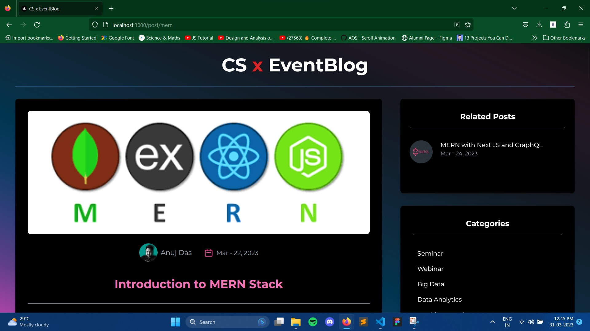

<h1 align="center">CS-x-EventBlog</h1>

CSxEventBlog is an official event highlight and blogging page of the Department of Computer Science - Gurucharan College, Silchar. 
#


## ⚙️Tech Stack Used! 
- Node.js
- React.js
- SCSS
- Tailwind CSS
- Next.js Framework
- Hygraph (GraphCMS)
- GraphQL
#

## 🔗Dependencies (Packages)! 
- graphql
- graphql-request
- html-react-parser
- moment
- next
- react
- react-dom
- react-multi-carousel
- sass

```
npm install graphql graphql-request html-react-parser moment next react react-dom react-multi-carousel sass 
```

## ✅Getting Started! 
Run the following command in the root directory!

```
npm install
```

## ⚠️Warning! 
Avoid using these two following commands. These commands may lead to production build failure.
```
npm audit fix
npm audit fix --force
```

## 🖼️Project Snaps!


#


#


#


#


#
